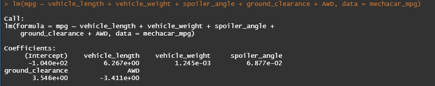

# MechaCar_Statistical_Analysis

## Linear Regression to Predict MPG
Summary: After reading in the `MechaCar_mpg.csv` file, the lm() function is used to pass in all six variables (columns from the dataset) to determine their coefficients. 
The function is used for building linear models, in which it takes in two main arguements 1. Formula 2. Data. Here in the function, the "Formula" is taking in the six variables,
whereas the "Data" is the dataframe created when we brought in the csv file. 

### Multiple Linear Regression Model 

### Multiple Linear Regression Model Summary
In order to run the summary of the regression model to ensure it's statistically signficant, there are two options to run it (both using the summary() function).
First, you can just pass the lm() formula we wrote as is through the summary () function -or- assign the lm() formula a variable and pass that variable through the summary() funtion. Either way, the results are the same.

<i>Which variables/coefficients provided a non-random amount of variance to the mpg values in the dataset?</i> 
answer.

<i>Is the slope of the linear model considered to be zero? Why or why not?</i> 
The slope is not considered to be zero as the intercept determines 

<i>Does this linear model predict mpg of MechaCar prototypes effectively? Why or why not?</i>

---

## Summary Statistics on Suspension Coils

   
<i>The design specifications for the MechaCar suspension coils dictate that the variance of the suspension coils must not exceed 100 pounds per square inch. Does the current manufacturing data meet this design specification for all manufacturing lots in total and each lot individually? Why or why not?</i> 

---

## T-Tests on Suspension Coils

<b>All Lots</b> 
 
<b>Lot1</b> 
 
<b>Lot2</b> 
 
<b>Lot3</b> 
 

<b>Summary:</b>

---
## Study Design: MechaCar vs Competition

<i>Write a short description of a statistical study that can quantify how the MechaCar performs against the competition. In your study design, think critically about what metrics would be of interest to a consumer: for a few examples, cost, city or highway fuel efficiency, horse power, maintenance cost, or safety rating. </i> 

<i><b>What metric or metrics are you going to test?</b></i> 

<i><b>What is the null hypothesis or alternative hypothesis?</b></i> 

<i><b>What statistical test would you use to test the hypothesis? And why?</b></i> 

<i><b>What data is needed to run the statistical test?</b></i> 
